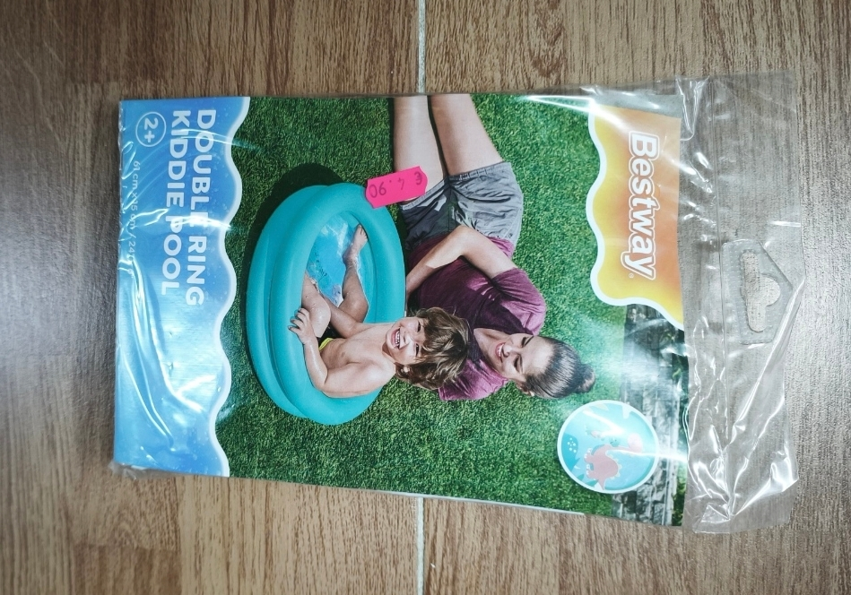
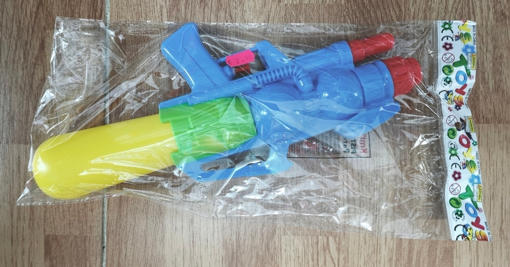
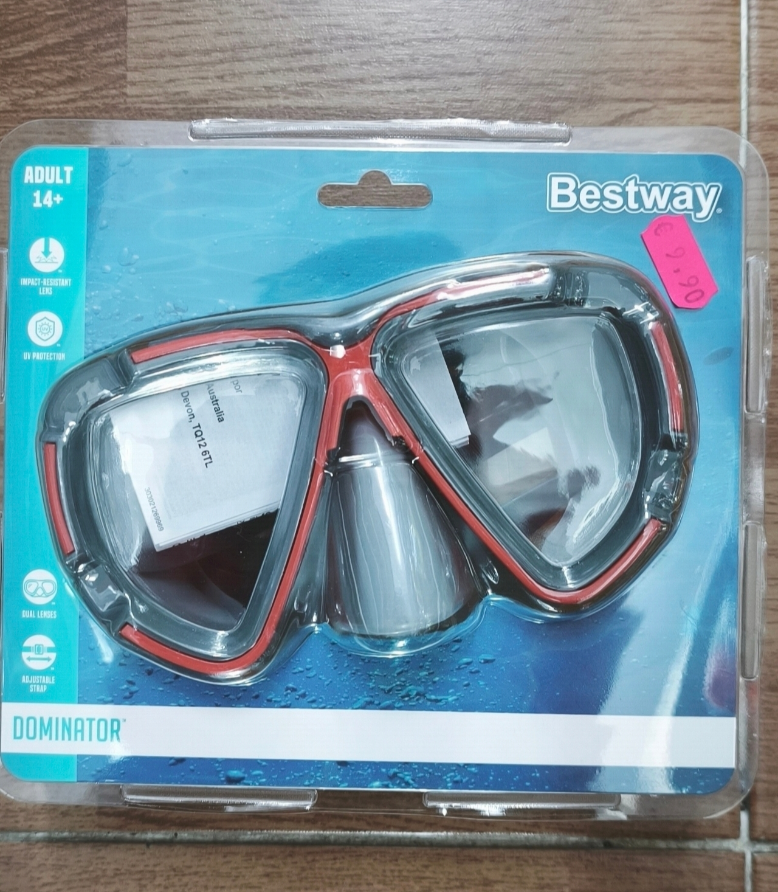

<!DOCTYPE html>

<html lang="es">

<head>

    <meta charset="UTF-8">

    <meta name="viewport" content="width=device-width, initial-scale=1.0">

    <meta name="description" content="Bazar Siglo en Colunga - Productos para el hogar, juguetes y más con trato cercano.">

    <title>Bazar Siglo - Colunga</title>

    

</head>

<body>

<header>

    <h1>BAZAR SIGLO</h1>

    
Calidad y cercanía en el corazón de Colunga

    <a href="#productos">Productos</a>

</header>

<main class="container">

    <!-- HORARIO -->

    <section class="horario">

        <h2>Horario</h2>

        
<strong>Lunes a Sábado:</strong> 9:00 - 21:00

        
<strong>Domingo:</strong> Cerrado

    </section>

    <!-- PRODUCTOS -->

    

        <h2>Productos de Temporada</h2>

    

    <section id="productos" class="grid-productos">

        <article class="producto-card">

            

            

                <h3>Piscina Infantil Double Ring</h3>

                
Perfecta para que los peques se refresquen este verano.

                4.90€

            

        </article>

        <article class="producto-card">

            

            

                <h3>Pistola de Agua Super Soaker</h3>

                
Diversión en la playa o el jardín.

                2.90€

            

        </article>

        <article class="producto-card">

            

            

                <h3>Gafas de Buceo Dominator</h3>

                
Protección UV y gran resistencia.

                9.90€

            

        </article>

        <!-- NUEVOS PRODUCTOS -->

        <article class="producto-card">

            

            

                <h3>Set de playa para niños</h3>

                
Incluye cubos, palas y moldes para horas de diversión en la arena.

                6.90€

            

        </article>

        <article class="producto-card">

            

            

                <h3>Raquetas con velcro</h3>

                
Juega en el jardín o la playa con estas raquetas ligeras y seguras.

                4.50€

            

        </article>

        <article class="producto-card">

            

            

                <h3>Set de buceo</h3>

                
Todo lo necesario para explorar el agua con seguridad y diversión.

                13.90€

            

        </article>

        <article class="producto-card">

            

            

                <h3>Gorro de piscina infantil</h3>

                
Protege el cabello de los peques mientras disfrutan del agua.

                2.90€

            

        </article>

        <article class="producto-card">

            

            

                <h3>Gafas de natación</h3>

                
Visión clara bajo el agua con protección cómoda para los ojos.

                2.90€

            

        </article>

        <article class="producto-card">

            

            

                <h3>Almohada de viaje hinchable</h3>

                
Viaja cómodo en coche o avión con esta almohada ligera y práctica.

                1.50€

            

        </article>

        <article class="producto-card">

            

            

                <h3>Red para piscina</h3>

                
Ideal para mantener el agua limpia, recogiendo hojas y restos fácilmente.

                5.50€

            

        </article>

    </section>

    <!-- SOBRE NOSOTROS -->

    <section class="sobre-nosotros">

        

            <h2>Sobre Nosotros</h2>

        

        

            Bienvenidos a <strong>Bazar Siglo</strong>, un negocio familiar en Colunga.

            Ofrecemos productos útiles para el día a día con trato cercano.

        

    </section>

    <!-- MAPA -->

    <section class="mapa">

        

            <h2>Ubicación</h2>

        

        

            <iframe 

                src="https://www.google.com/maps?q=Calle+Loreto,+Colunga,+Asturias&output=embed"

                width="100%" 

                height="350" 

                style="border:0;" 

                allowfullscreen="" 

                loading="lazy">

            </iframe>

        

    </section>

</main>

<footer>

    
<strong>Bazar Siglo - Colunga</strong>

    <address class="direccion">Calle Loreto, Colunga, Asturias</address>

    

        © 2026 Todos los derechos reservados.

    

</footer>

</body>

</html>